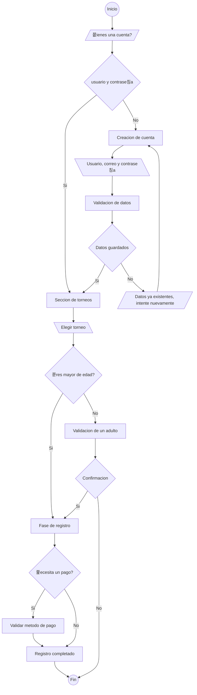

    

# SkillTourney

## Nosotros

Somos una plataforma de videojuegos diseñada para impulsar tanto a jugadores como a marcas hacia el siguiente nivel dentro del mundo de los eSports. Ya seas un competidor en busca de reconocimiento o una compañía en busca de visibilidad auténtica, aquí encontrarás el espacio ideal para crecer, conectar y destacar en la escena competitiva.

### Mision y Vision

🎯 Nuestra misión es construir una comunidad sólida y vibrante que conecte a jugadores de todos los niveles con marcas emergentes y consolidadas. Buscamos crear un espacio donde el talento sea reconocido, las oportunidades se multipliquen y el mundo de los eSports crezca de manera sostenible y colaborativa. A través de torneos dinámicos, rankings competitivos y herramientas integradas, queremos ser el puente entre la pasión por los videojuegos y el desarrollo profesional dentro del gaming.

💡Nuestra visión es convertirnos en una referencia clave dentro del ecosistema de los eSports, siendo la plataforma ideal donde jugadores amateurs y veteranos puedan desarrollarse, competir y destacar. Aspiramos a ofrecer un entorno justo, accesible y emocionante, donde las marcas encuentren el escenario perfecto para conectar con una audiencia auténtica y comprometida.

## Objetivos

- Proporcionar un aplicativo web que permita a los jugadores registrarse y participar en torneos de videojuegos de manera online.
- Ofrecer herramientas que faciliten el seguimiento del rendimiento individual y grupal (clanes) mediante sistemas de ranking y estadísticas.
- Fomentar la creación de una comunidad competitiva activa donde los usuarios puedan interactuar, competir y mejorar sus habilidades.
- Brindar una experiencia de usuario intuitiva, rápida y accesible desde cualquier dispositivo con conexión a internet.

## Alcances

- La plataforma permitirá la administracion de torneos de esports de manera online.
- Los usuarios podrán registrarse, personalizar su perfil y visualizar su historial de participación.
- La plataforma integrará funciones de notificaciones por correo electrónico para alertas importantes.
- Habrá visibilidad pública de torneos en curso y finalizados.
- Se contempla la integración con plataformas de streaming para visualizar partidas en tiempo real.
- El sistema será accesible desde distintos dispositivos gracias a su diseño responsivo.

## Limitaciones

- No se incluye en esta versión la verificación automática de resultados (debe ser registrada manualmente por organizadores o administradores).
- La aplicación dependerá de servicios externos (como correos o streaming) que podrían presentar interrupciones ajenas al sistema.
- No se garantiza compatibilidad con navegadores obsoletos o sin soporte moderno.
- No se contempla la creación de una app nativa móvil en esta etapa del proyecto.
- La moderación de contenido ofensivo en perfiles o chats no está automatizada, será responsabilidad del administrador intervenir cuando se detecten abusos.
- Actualmente solo se ecuenta con dos juegos en el sistema de torneos

|  |  |
| --------------------- | ----------------------- |

## Funcionalidades

- El sistema debe permitir que los usuarios se registren he inicien sesion utilizando su correo electrónico y una contraseña segura.
- Los usuarios deben poder editar su perfil.
- El sistema debe mostrar a cada usuario su historial de torneos jugados junto con los resultados obtenidos.
- Los organizadores deben tener la posibilidad de crear y administrar sus propios torneos.
- Los jugadores deben poder inscribirse en los torneos disponibles desde la plataforma.
- El sistema debe enviar notificaciones importantes al correo electrónico de los usuarios.

## Proceso de registro a un torneo

## Tecnologias usadas

- **Java**

  El lenguaje de programacion escogir para este proyecto es [Java](https://www.youtube.com/watch?v=crBLydQRUsk). Siendo un lenguaje de tipo multiplataforma y orientado a objetos, se ejecuta en miles de millones de dispositivos, incluyendo computadoras, teléfonos inteligentes, dispositivos IoT y más.

- **Spring boot**

  Java Spring Boot ([Spring Boot](https://www.youtube.com/watch?v=wlZWt_fIAyM)) es una herramienta que hace que el desarrollo de aplicaciones web y microservicios con Spring Framework sea más rápido y fácil a través de tres funcionalidades principales:

  1. Configuración automática

  2. Un enfoque obstinado de la configuración

  3. La capacidad de crear aplicaciones independientes

  Estas características funcionan juntas para brindarle una herramienta que le permite configurar una aplicación basada en Spring con una configuración y preparación mínimas.

- **Spring Security**

  [Spring Security](https://www.youtube.com/watch?v=fmKkU5uuNr0) es un marco que se centra en proporcionar autenticación y autorización a las aplicaciones Java. Al igual que todos los proyectos de Spring, el poder real de Spring Security se encuentra en la facilidad con la que se puede extender para cumplir con los requisitos personalizados

  _Características:_

  - _Soporte integral y extensible tanto para Autenticación como para Autorización_

  - _Protección contra ataques como fijación de sesión, clickjacking, falsificación de solicitudes entre sitios, etc_

  - _Integración de API de Servlet_

  - _Integración opcional con Spring Web MVC_

  - Mucho más...

- **HTML, CSS y JavaScript**

  [HTML](https://www.youtube.com/watch?v=10GHKjgQIR0), [CSS](https://www.youtube.com/watch?v=8cSo0ijtkzU) y [Javascript](https://www.youtube.com/watch?v=riZbwRFMFuw) son tres lenguajes que se utilizan en el Front End, es decir, que se utilizan en el lado del usuario. HTML existe desde los inicios de Internet y a partir del crecimiento de este lenguaje surge CSS para mejorar la parte estética de los website creados a partir de HTML. Por último surge Javascript para darle interactividad.

  - HTML: 
  
    Se utiliza para programar la estructura semántica de un website a través del uso de etiquetas.

  - CSS: 
  
    Se trata de un lenguaje de estilo, por ende, se usa para programar la estética y visual del sitio.

  - JavaScript: 
  
    Su función es proporcionar dinamismo e interactividad a los websites, pero también posibilita el procesamiento y transformación de los datos enviados y recibidos.
  

- MySQL

    [MySQL](https://www.youtube.com/watch?v=PXuMYHvvFrA) es el sistema de gestión de bases de datos de código abierto más popular del mundo. Las bases de datos son los repositorios de información esencial para todas las aplicaciones de software. Por ejemplo, cada vez que alguien realiza una búsqueda en Internet, inicia sesión en una cuenta o completa una transacción, una base de datos almacena la información para poder acceder a ella en el futuro. MySQL sobresale en esta tarea.

## Base de datos MySQL ER (Entidad-Relacion)

## Contacto

### Enlaces de contacto

---
***Proeycto en proceso***
